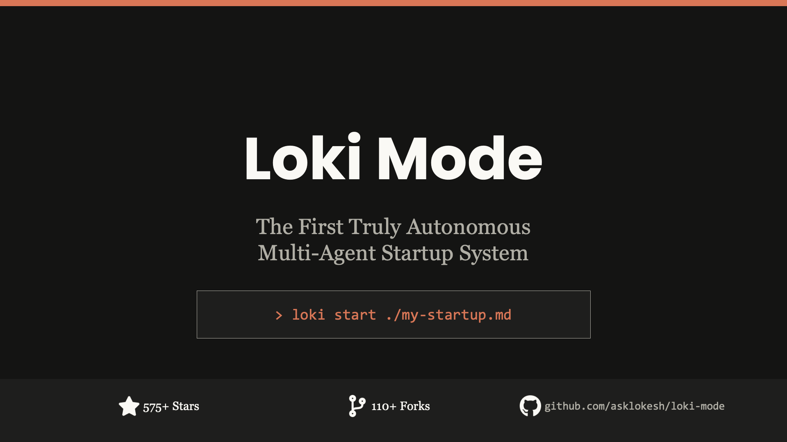
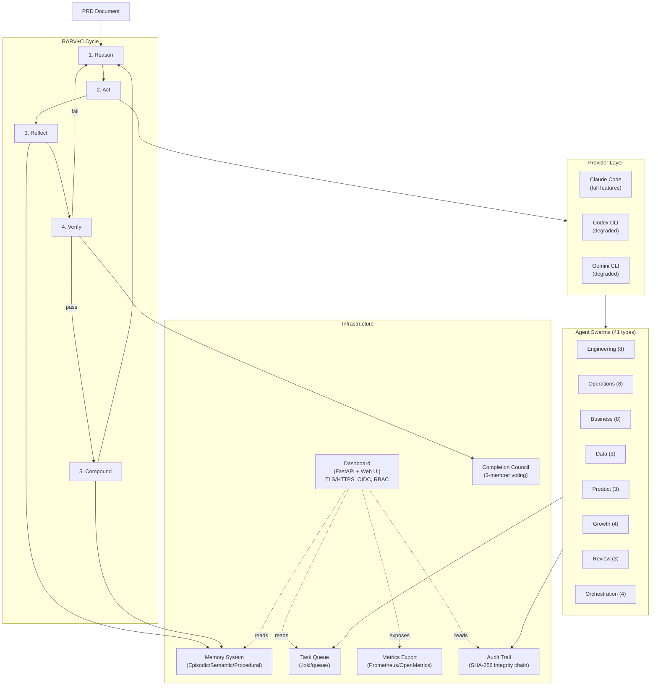

# Loki Mode

**The Flagship Product of [Autonomi](https://www.autonomi.dev/) -- An Autonomous Multi-Agent Development System**

[](https://www.npmjs.com/package/loki-mode)
[](https://www.npmjs.com/package/loki-mode)
[](https://github.com/asklokesh/loki-mode)
[](https://opensource.org/licenses/MIT)
[](https://github.com/marketplace/actions/loki-mode-code-review)
[](https://www.autonomi.dev/)
[]()
[](benchmarks/)

**Current Version: v5.51.0**

**[Autonomi](https://www.autonomi.dev/)** | **[Documentation](https://www.autonomi.dev/docs)** | **[GitHub](https://github.com/asklokesh/loki-mode)**

> **PRD to Deployed Product with Minimal Human Intervention**
>
> Loki Mode transforms a Product Requirements Document into a fully built, tested, and deployed product with autonomous multi-agent execution. Human oversight for deployment credentials, domain setup, and critical decisions.

---

## Demo

[](https://asciinema.org/a/AjjnjzOeKLYItp6s)

*Click to watch Loki Mode v5.42 -- CLI commands, dashboard, 8 parallel agents, 9-gate quality, Completion Council, memory system*

---

## Presentation



*9 slides: Problem, Solution, 41 Agents, RARV Cycle, Benchmarks, Multi-Provider, Full Lifecycle*

**[Download PPTX](docs/loki-mode-presentation.pptx)** for offline viewing

---

## Installation

### npm (Recommended)

```bash
npm install -g loki-mode
```

Installs the `loki` CLI and automatically sets up the skill for Claude Code, Codex CLI, and Gemini CLI.

### Homebrew

```bash
brew tap asklokesh/tap && brew install loki-mode
```

Installs the `loki` CLI. To also install the skill for interactive use:

```bash
loki setup-skill
```

### Quick Start

```bash
# CLI mode (works with any provider)
loki start ./prd.md
loki start ./prd.md --provider codex
loki start ./prd.md --provider gemini

# Interactive mode (inside your coding agent)
claude --dangerously-skip-permissions
# Then say: "Loki Mode with PRD at ./my-prd.md"

# Or in Codex CLI:
codex
# Then say: "Use Loki Mode with PRD at ./my-prd.md"

# Or in Gemini CLI:
gemini
# Then say: "Use Loki Mode with PRD at ./my-prd.md"
```

### Verify Installation

```bash
loki --version    # Should print 5.51.0
loki doctor       # Check skill symlinks and provider availability
```

### Other Methods

Git clone, Docker, GitHub Action, and VS Code Extension are also available. See [docs/alternative-installations.md](docs/alternative-installations.md).

### Update

```bash
npm update -g loki-mode    # npm
brew upgrade loki-mode     # Homebrew
```

### Multi-Provider Support (v5.0.0)

| Provider | Features | Parallel Agents | Task Tool |
|----------|----------|-----------------|-----------|
| Claude | Full | Yes (10+) | Yes |
| Codex | Degraded | No | No |
| Gemini | Degraded | No | No |

See [skills/providers.md](skills/providers.md) for full provider documentation.

---

## Benchmarks

Benchmark infrastructure is included for HumanEval and SWE-bench evaluation. Results are self-reported from the included test harness and have not been independently verified.

| Benchmark | Result | Notes |
|-----------|--------|-------|
| HumanEval | 162/164 (98.78%) | Self-reported, max 3 retries per problem |
| SWE-bench | 299/300 patches generated | Patch generation only -- SWE-bench evaluator not yet run to verify correctness |

**Note:** SWE-bench "patch generation" means the system produced a patch file, not that the patch correctly resolves the issue. The SWE-bench evaluator should be run to determine actual resolution rates.

See [benchmarks/](benchmarks/) for the test harness and raw results.

---

## What is Loki Mode?

Loki Mode is a multi-provider AI skill that orchestrates **41 specialized AI agent types** across **8 swarms** to autonomously build, test, and deploy software projects. Works with **Claude Code**, **OpenAI Codex CLI**, and **Google Gemini CLI**. It dynamically spawns agents as needed -- typically **5-10 for simple projects, more for complex ones** -- working in parallel with continuous self-verification.

```
PRD → Research → Architecture → Development → Testing → Deployment → Marketing
```

**Just say "Loki Mode" and point to a PRD. Walk away. Come back to a deployed product.**

---

## Current Limitations

Loki Mode is powerful but not magic. Be aware of these honest limitations:

| Area | What Works | What Doesn't (Yet) |
|------|-----------|---------------------|
| **Code Generation** | Generates full-stack applications from PRDs | Complex domain logic may need human review and correction |
| **Deployment** | Generates deployment configs and scripts | Does not have cloud credentials -- human must provide and authorize |
| **Testing** | 9 automated quality gates, blind review | Test quality depends on AI-generated assertions; mutation testing is heuristic |
| **Business Ops** | Generates marketing copy, legal templates | Does not actually send emails, file legal documents, or process payments |
| **Multi-Provider** | Claude (full), Codex (degraded), Gemini (degraded) | Codex and Gemini lack parallel agents and Task tool -- sequential only |
| **Memory System** | Episodic, semantic, procedural memory tiers | Vector search requires optional `sentence-transformers` dependency |
| **Enterprise Security** | TLS, OIDC, RBAC, audit trail, SIEM configs | Self-signed certs only; production deployments need real certificates |
| **Dashboard** | Real-time status, task queue, agent monitoring | Single-machine only; no multi-node dashboard clustering |
| **Benchmarks** | HumanEval 98.78%, SWE-bench 299/300 patches | Self-reported; SWE-bench counts patch generation, not verified resolution |

**What "autonomous" means in practice:**
- Loki Mode runs without prompting between RARV cycles
- It does NOT have access to your cloud accounts, payment systems, or external services unless you provide credentials
- Human oversight is expected for: deployment credentials, domain setup, API keys, and critical business decisions
- The system is as good as the underlying AI model -- it can make mistakes, especially on novel or complex problems

## What To Expect

| Project Type | Examples | Autonomy Level | Typical Experience |
|---|---|---|---|
| Simple | Landing page, todo app, static site, single API | High | Completes with minimal retries. Human reviews output. |
| Standard | CRUD app with auth, REST API + React frontend | Medium | Completes most features. Complex components may need guidance. |
| Complex | Microservices, real-time systems, ML pipelines | Guided | Use as accelerator. Human reviews between phases. |

"Autonomous" means the system runs RARV cycles without prompting. It does NOT mean zero oversight.

---

## Why Loki Mode?

### **How It Works**

| What Others Do | What Loki Mode Does |
|----------------|---------------------|
| **Single agent** writes code linearly | **Multiple agents** work in parallel across engineering, ops, business, data, product, and growth |
| **Manual deployment** required | **Autonomous deployment** to AWS, GCP, Azure, Vercel, Railway with blue-green and canary strategies |
| **No testing** or basic unit tests | **9 automated quality gates**: input/output guardrails, static analysis, blind review, anti-sycophancy, severity blocking, test coverage, mock detection, mutation detection |
| **Code only** - you handle the rest | **Full business operations**: marketing, sales, legal, HR, finance, investor relations |
| **Stops on errors** | **Self-healing**: circuit breakers, dead letter queues, exponential backoff, automatic recovery |
| **No visibility** into progress | **Real-time dashboard** with agent monitoring, task queues, and live status updates |
| **"Done" when code is written** | **Never "done"**: continuous optimization, A/B testing, customer feedback loops, perpetual improvement |
| **No security controls** | **Enterprise-ready**: TLS/HTTPS, OIDC/SSO, RBAC, audit trails, SIEM integration, Prometheus metrics (v5.36.0-v5.38.0) |
| **Direct commits to main** | **Branch protection**: auto-create feature branches, clean PR workflow, never touches main directly (v5.37.0) |

### **Core Advantages**

1. **Self-Verifying**: RARV (Reason-Act-Reflect-Verify) cycle with continuous self-verification catches errors early
2. **Parallel Execution**: Multiple agents working simultaneously, not sequential single-agent bottlenecks
3. **Production-Ready**: Not just code—handles deployment, monitoring, incident response, and business operations
4. **Self-Improving**: Learns from mistakes, updates continuity logs, prevents repeated errors
5. **Zero Babysitting**: Auto-resumes on rate limits, recovers from failures, runs until completion
6. **Efficiency Optimized**: ToolOrchestra-inspired metrics track cost per task, reward signals drive continuous improvement

---

## Features & Documentation

| Feature | Description | Documentation |
|---------|-------------|---------------|
| **VS Code Extension** | Visual interface with sidebar, status bar | [Marketplace](https://marketplace.visualstudio.com/items?itemName=asklokesh.loki-mode) |
| **Multi-Provider (v5.0.0)** | Claude, Codex, Gemini support | [Provider Guide](skills/providers.md) |
| **CLI (v4.1.0)** | `loki` command for start/stop/pause/status | [CLI Commands](#cli-commands-v410) |
| **Config Files** | YAML configuration support | [autonomy/config.example.yaml](autonomy/config.example.yaml) |
| **Dashboard** | Realtime Kanban board, agent monitoring | [Dashboard Guide](docs/dashboard-guide.md) |
| **TLS/HTTPS (v5.36.0)** | Dashboard encryption with self-signed certs | [Network Security](docs/network-security.md) |
| **OIDC/SSO (v5.36.0)** | Google, Azure AD, Okta authentication | [Authentication Guide](docs/authentication.md) |
| **RBAC (v5.37.0)** | Admin, operator, viewer, auditor roles | [Authorization Guide](docs/authorization.md) |
| **Metrics Export (v5.38.0)** | Prometheus/OpenMetrics `/metrics` endpoint | [Metrics Guide](docs/metrics.md) |
| **Branch Protection (v5.37.0)** | Auto-create feature branches for PRs | [Git Workflow](docs/git-workflow.md) |
| **Audit Trail (v5.37.0)** | Agent action logging with integrity chain | [Audit Logging](docs/audit-logging.md) |
| **SIEM Integration (v5.38.0)** | Syslog forwarding for enterprise security | [SIEM Guide](docs/siem-integration.md) |
| **OpenClaw Bridge (v5.38.0)** | Multi-agent coordination protocol | [OpenClaw Integration](docs/openclaw-integration.md) |
| **41 Agent Types** | Engineering, Ops, Business, Data, Product, Growth, Orchestration | [Agent Definitions](references/agent-types.md) |
| **RARV Cycle** | Reason-Act-Reflect-Verify workflow | [Core Workflow](references/core-workflow.md) |
| **Quality Gates** | 9-gate system: guardrails, static analysis, blind review, anti-sycophancy, severity blocking, test coverage, mock detection, mutation detection | [Quality Control](references/quality-control.md) |
| **Memory System (v5.15.0)** | Complete 3-tier memory with progressive disclosure | [Memory Architecture](references/memory-system.md) |
| **Parallel Workflows** | Git worktree-based parallelism | [Parallel Workflows](skills/parallel-workflows.md) |
| **GitHub Integration** | Issue import, PR creation, status sync | [GitHub Integration](skills/github-integration.md) |
| **Distribution** | npm, Homebrew, Docker installation | [Installation Guide](docs/INSTALLATION.md) |
| **Research Foundation** | OpenAI, DeepMind, Anthropic patterns | [Acknowledgements](docs/ACKNOWLEDGEMENTS.md) |
| **Benchmarks** | HumanEval and SWE-bench infrastructure included | [Benchmark Harness](benchmarks/) |
| **Comparisons** | vs Auto-Claude, Cursor | [Auto-Claude](docs/auto-claude-comparison.md), [Cursor](docs/cursor-comparison.md) |

---

## Enterprise Security & Compliance (v5.36.0-v5.38.0)

Loki Mode now includes production-ready security and compliance features for enterprise deployments:

### **Authentication & Authorization**
- **TLS/HTTPS Encryption**: Self-signed certificates for dashboard encryption (v5.36.0)
- **OIDC/SSO Integration**: Support for Google, Azure AD, and Okta authentication (v5.36.0)
- **RBAC Roles**: Four-tier role system (v5.37.0)
  - **Admin**: Full control, configuration changes, user management
  - **Operator**: Start/stop sessions, modify tasks, execute actions
  - **Viewer**: Read-only dashboard access, view logs and metrics
  - **Auditor**: Access audit logs, compliance reports, security events

### **Observability & Monitoring**
- **Prometheus/OpenMetrics**: `/metrics` endpoint for production monitoring (v5.38.0)
  - Task completion rates, agent performance, memory usage
  - Integration with Grafana, Datadog, New Relic
- **Audit Trail**: SHA-256 integrity chain for all agent actions (v5.37.0)
  - Tamper-evident logging with cryptographic verification
  - Complete action history: who did what, when, and why
- **SIEM Integration**: Syslog forwarding (RFC 5424) for enterprise security (v5.38.0)
  - Send logs to Splunk, QRadar, ArcSight, Elastic SIEM
  - Real-time security event detection and alerting

### **Development Safety**
- **Branch Protection**: Auto-create feature branches for all PR work (v5.37.0)
  - Never commits directly to main/master
  - Automatic branch naming: `loki/feature/<task-id>`
  - Clean merge workflow with squash commits
- **OpenClaw Bridge**: Multi-agent coordination protocol integration (v5.38.0)
  - Standardized inter-agent communication
  - Cross-system orchestration support

### **Quick Start (Enterprise Mode)**

```bash
# Enable TLS/HTTPS
export LOKI_TLS_ENABLED=true
export LOKI_TLS_CERT=/path/to/cert.pem
export LOKI_TLS_KEY=/path/to/key.pem

# Configure OIDC
export LOKI_OIDC_PROVIDER=google
export LOKI_OIDC_CLIENT_ID=your-client-id
export LOKI_OIDC_CLIENT_SECRET=your-client-secret

# Enable audit logging
export LOKI_AUDIT_ENABLED=true
export LOKI_AUDIT_INTEGRITY_CHECK=true

# Enable Prometheus metrics
export LOKI_METRICS_ENABLED=true

# Start with enterprise features
loki start --enterprise ./my-prd.md
```

For detailed configuration, see [docs/network-security.md](docs/network-security.md), [docs/authentication.md](docs/authentication.md), and [docs/authorization.md](docs/authorization.md).

---

## Dashboard & Real-Time Monitoring

Monitor your autonomous startup being built in real-time through the Loki Mode dashboard:

### **Agent Monitoring**


**Track all active agents in real-time:**
- **Agent ID** and **Type** (frontend, backend, QA, DevOps, etc.)
- **Model Badge** (Sonnet, Haiku, Opus) with color coding
- **Current Work** being performed
- **Runtime** and **Tasks Completed**
- **Status** (active, completed)

### **Task Queue Visualization**


**Four-column kanban view:**
- **Pending**: Queued tasks waiting for agents
- **In Progress**: Currently being worked on
- **Completed**: Successfully finished (shows last 10)
- **Failed**: Tasks requiring attention

### **Live Status Monitor**

```bash
# Watch status updates in terminal
watch -n 2 cat .loki/STATUS.txt
```

```
╔════════════════════════════════════════════════════════════════╗
║                    LOKI MODE STATUS                            ║
╚════════════════════════════════════════════════════════════════╝

Phase: DEVELOPMENT

Active Agents: 47
  ├─ Engineering: 18
  ├─ Operations: 12
  ├─ QA: 8
  └─ Business: 9

Tasks:
  ├─ Pending:     10
  ├─ In Progress: 47
  ├─ Completed:   203
  └─ Failed:      0

Last Updated: 2026-01-04 20:45:32
```

**Access the dashboard:**
```bash
# Automatically starts when running autonomously
./autonomy/run.sh ./docs/requirements.md

# Or open manually
open http://localhost:57374
# HTTPS mode (v5.36.0+):
open https://localhost:57374
```

The dashboard at `http://localhost:57374` (or `https://localhost:57374` with TLS enabled) auto-refreshes via WebSocket. Works with any modern browser.

---

## Autonomous Capabilities

### **RARV Cycle: Reason-Act-Reflect-Verify**

Loki Mode doesn't just write code—it **thinks, acts, learns, and verifies**:

```
1. REASON
   └─ Read .loki/CONTINUITY.md including "Mistakes & Learnings"
   └─ Check .loki/state/ and .loki/queue/
   └─ Identify next task or improvement

2. ACT
   └─ Execute task, write code
   └─ Commit changes atomically (git checkpoint)

3. REFLECT
   └─ Update .loki/CONTINUITY.md with progress
   └─ Update state files
   └─ Identify NEXT improvement

4. VERIFY
   └─ Run automated tests (unit, integration, E2E)
   └─ Check compilation/build
   └─ Verify against spec

   IF VERIFICATION FAILS:
   ├─ Capture error details (stack trace, logs)
   ├─ Analyze root cause
   ├─ UPDATE "Mistakes & Learnings" in CONTINUITY.md
   ├─ Rollback to last good git checkpoint if needed
   └─ Apply learning and RETRY from REASON
```

**Result:** Improved quality through continuous self-verification and multi-reviewer code review.

### **Perpetual Improvement Mode**

There is **NEVER** a "finished" state. After completing the PRD, Loki Mode:
- Runs performance optimizations
- Adds missing test coverage
- Improves documentation
- Refactors code smells
- Updates dependencies
- Enhances user experience
- Implements A/B test learnings

**It keeps going until you stop it.**

### **Auto-Resume & Self-Healing**

**Rate limits?** Exponential backoff and automatic resume.
**Errors?** Circuit breakers, dead letter queues, retry logic.
**Interruptions?** State checkpoints every 5 seconds—just restart.

```bash
# Start autonomous mode
./autonomy/run.sh ./docs/requirements.md

# Hit rate limit? Script automatically:
# ├─ Saves state checkpoint
# ├─ Waits with exponential backoff (60s → 120s → 240s...)
# ├─ Resumes from exact point
# └─ Continues until completion or max retries (default: 50)
```

---

## Quick Start

### **1. Write a PRD**

```markdown
# Product: AI-Powered Todo App

## Overview
Build a todo app with AI-powered task suggestions and deadline predictions.

## Features
- User authentication (email/password)
- Create, read, update, delete todos
- AI suggests next tasks based on patterns
- Smart deadline predictions
- Mobile-responsive design

## Tech Stack
- Next.js 14 with TypeScript
- PostgreSQL database
- OpenAI API for suggestions
- Deploy to Vercel
```

Save as `my-prd.md`.

### **2. Run It**

```bash
loki start ./my-prd.md
```

### **3. Monitor and Walk Away**

```bash
loki status              # Check progress
loki dashboard           # Open web dashboard
```

Go get coffee. It'll be deployed when you get back.

---

## Architecture



**Key components:**
- **RARV+C Cycle** -- Reason, Act, Reflect, Verify, Compound. Every iteration follows this loop. Failed verification triggers retry from Reason.
- **Provider Layer** -- Claude Code (full parallel agents, Task tool, MCP), Codex CLI and Gemini CLI (sequential, degraded mode).
- **Agent Swarms** -- 41 specialized agent types across 8 swarms, spawned on demand based on project complexity.
- **Completion Council** -- 3 members vote on whether the project is done. Anti-sycophancy devil's advocate on unanimous votes.
- **Memory System** -- Episodic traces, semantic patterns, procedural skills. Progressive disclosure reduces context usage by 60-80%.
- **Dashboard** -- FastAPI server reading `.loki/` flat files, with real-time web UI for task queue, agents, logs, and council state. Now with TLS/HTTPS, OIDC/SSO, and RBAC (v5.36.0-v5.37.0).
- **Metrics Export** -- Prometheus/OpenMetrics endpoint for production monitoring (v5.38.0).
- **Audit Trail** -- SHA-256 integrity chain for tamper-evident logging of all agent actions (v5.37.0).

---

## CLI Commands

The `loki` CLI provides easy access to all Loki Mode features:

| Command | Description |
|---------|-------------|
| `loki start [PRD]` | Start Loki Mode with optional PRD file |
| `loki stop` | Stop execution immediately |
| `loki pause` | Pause after current session |
| `loki resume` | Resume paused execution |
| `loki status` | Show current status |
| `loki dashboard` | Open dashboard in browser |
| `loki import` | Import GitHub issues as tasks |
| `loki config show` | Show configuration |
| `loki config init` | Create config file from template |
| `loki audit logs` | View audit trail (v5.37.0) |
| `loki audit verify` | Verify log integrity chain (v5.37.0) |
| `loki metrics` | Display Prometheus metrics (v5.38.0) |
| `loki syslog test` | Test SIEM integration (v5.38.0) |
| `loki version` | Show version |

### Configuration File

Create a YAML config file for persistent settings:

```bash
# Initialize config
loki config init

# Or copy template manually
cp ~/.claude/skills/loki-mode/autonomy/config.example.yaml .loki/config.yaml
```

Config search order: `.loki/config.yaml` (project) -> `~/.config/loki-mode/config.yaml` (global)

---

## Agent Swarms (41 Types)

Loki Mode has **41 predefined agent types** organized into **8 specialized swarms**. The orchestrator spawns only what you need -- simple projects typically use 5-10 agents, complex ones may use more.


### **Engineering (8 types)**
`eng-frontend` `eng-backend` `eng-database` `eng-mobile` `eng-api` `eng-qa` `eng-perf` `eng-infra`

### **Operations (8 types)**
`ops-devops` `ops-sre` `ops-security` `ops-monitor` `ops-incident` `ops-release` `ops-cost` `ops-compliance`

### **Business (8 types)**
`biz-marketing` `biz-sales` `biz-finance` `biz-legal` `biz-support` `biz-hr` `biz-investor` `biz-partnerships`

### **Data (3 types)**
`data-ml` `data-eng` `data-analytics`

### **Product (3 types)**
`prod-pm` `prod-design` `prod-techwriter`

### **Growth (4 types)**
`growth-hacker` `growth-community` `growth-success` `growth-lifecycle`

### **Review (3 types)**
`review-code` `review-business` `review-security`

### **Orchestration (4 types)**
`orch-planner` `orch-sub-planner` `orch-judge` `orch-coordinator`

See [Agent Types](references/agent-types.md) for the full list of 41 specialized agents with detailed capabilities.

---

## How It Works

### **Skill Architecture (v3.0+)**

Loki Mode uses a **progressive disclosure architecture** to minimize context usage:

```
SKILL.md (~190 lines)         # Always loaded: core RARV cycle, autonomy rules
skills/
  00-index.md                  # Module routing table
  agents.md                    # Agent dispatch, A2A patterns
  production.md                # HN patterns, batch processing, CI/CD
  quality-gates.md             # Review system, severity handling
  testing.md                   # Playwright, E2E, property-based
  model-selection.md           # Task tool, parallelization
  artifacts.md                 # Code generation patterns
  patterns-advanced.md         # Constitutional AI, debate
  troubleshooting.md           # Error recovery, fallbacks
references/                    # Deep documentation (23KB+ files)
```

**Why this matters:**
- Original 1,517-line SKILL.md consumed ~15% of context before any work began
- Now only ~1% of context for core skill + on-demand modules
- More room for actual code and reasoning

### **Phase Execution**

| Phase | Description |
|-------|-------------|
| **0. Bootstrap** | Create `.loki/` directory structure, initialize state |
| **1. Discovery** | Parse PRD, competitive research via web search |
| **2. Architecture** | Tech stack selection with self-reflection |
| **3. Infrastructure** | Provision cloud, CI/CD, monitoring |
| **4. Development** | Implement with TDD, parallel code review |
| **5. QA** | 9 quality gates, security audit, load testing |
| **6. Deployment** | Blue-green deploy, auto-rollback on errors |
| **7. Business** | Marketing, sales, legal, support setup |
| **8. Growth** | Continuous optimization, A/B testing, feedback loops |

### **Parallel Code Review**

Every code change goes through **3 specialized reviewers simultaneously**:

```
IMPLEMENT → REVIEW (parallel) → AGGREGATE → FIX → RE-REVIEW → COMPLETE
                │
                ├─ code-reviewer (Sonnet) - Code quality, patterns, best practices
                ├─ business-logic-reviewer (Sonnet) - Requirements, edge cases, UX
                └─ security-reviewer (Sonnet) - Vulnerabilities, OWASP Top 10
```

**Severity-based issue handling:**
- **Critical/High/Medium**: Block. Fix immediately. Re-review.
- **Low**: Add `// TODO(review): ...` comment, continue.
- **Cosmetic**: Add `// FIXME(nitpick): ...` comment, continue.

### **Directory Structure**

```
.loki/
├── state/          # Orchestrator and agent states
├── queue/          # Task queue (pending, in-progress, completed, dead-letter)
├── memory/         # Episodic, semantic, and procedural memory
├── metrics/        # Efficiency tracking and reward signals
├── messages/       # Inter-agent communication
├── logs/           # Audit logs
├── audit/          # Audit trail with SHA-256 integrity chain (v5.37.0)
├── security/       # TLS certificates, OIDC configs (v5.36.0)
├── rbac/           # Role definitions and permissions (v5.37.0)
├── config/         # Configuration files
├── prompts/        # Agent role prompts
├── artifacts/      # Releases, reports, backups
├── dashboard/      # Real-time monitoring dashboard
└── scripts/        # Helper scripts
```

### **Memory System (v5.15.0)**

Complete 3-tier memory architecture with progressive disclosure:

```
WORKING MEMORY (CONTINUITY.md)
        |
        v
EPISODIC MEMORY (.loki/memory/episodic/)
        |
        v (consolidation)
SEMANTIC MEMORY (.loki/memory/semantic/)
        |
        v
PROCEDURAL MEMORY (.loki/memory/skills/)
```

**Key Features:**
- **Progressive Disclosure**: 3-layer loading (index ~100 tokens, timeline ~500 tokens, full details) reduces context usage by 60-80%
- **Token Economics**: Track discovery vs read tokens, automatic threshold-based optimization
- **Vector Search**: Optional embedding-based similarity search (sentence-transformers)
- **Consolidation Pipeline**: Automatic episodic-to-semantic transformation
- **Task-Aware Retrieval**: Different memory strategies for exploration, implementation, debugging, review, and refactoring

**CLI Commands:**
```bash
loki memory index           # View index layer
loki memory timeline        # View compressed history
loki memory consolidate     # Run consolidation pipeline
loki memory economics       # View token usage metrics
loki memory retrieve "query"  # Test task-aware retrieval
```

**API Endpoints:**
- `GET /api/memory/summary` - Memory summary
- `POST /api/memory/retrieve` - Query memories
- `POST /api/memory/consolidate` - Trigger consolidation
- `GET /api/memory/economics` - Token economics

See [references/memory-system.md](references/memory-system.md) for complete documentation.

---

## Example PRDs

Test Loki Mode with these pre-built PRDs in the `examples/` directory:

| PRD | Complexity | Est. Time | Description |
|-----|------------|-----------|-------------|
| `simple-todo-app.md` | Low | ~10 min | Basic todo app - tests core functionality |
| `api-only.md` | Low | ~10 min | REST API only - tests backend agents |
| `static-landing-page.md` | Low | ~5 min | HTML/CSS only - tests frontend/marketing |
| `full-stack-demo.md` | Medium | ~30-60 min | Complete bookmark manager - full test |

```bash
# Example: Run with simple todo app
./autonomy/run.sh examples/simple-todo-app.md
```

---

## Configuration

### **Autonomy Settings**

Customize the autonomous runner with environment variables:

```bash
LOKI_MAX_RETRIES=100 \
LOKI_BASE_WAIT=120 \
LOKI_MAX_WAIT=7200 \
./autonomy/run.sh ./docs/requirements.md
```

| Variable | Default | Description |
|----------|---------|-------------|
| `LOKI_PROVIDER` | claude | AI provider: claude, codex, gemini |
| `LOKI_MAX_RETRIES` | 50 | Maximum retry attempts before giving up |
| `LOKI_BASE_WAIT` | 60 | Base wait time in seconds |
| `LOKI_MAX_WAIT` | 3600 | Maximum wait time (1 hour) |
| `LOKI_SKIP_PREREQS` | false | Skip prerequisite checks |
| `LOKI_TLS_ENABLED` | false | Enable HTTPS/TLS for dashboard (v5.36.0) |
| `LOKI_OIDC_PROVIDER` | - | OIDC provider: google, azure, okta (v5.36.0) |
| `LOKI_RBAC_ENABLED` | false | Enable role-based access control (v5.37.0) |
| `LOKI_AUDIT_ENABLED` | false | Enable audit logging with integrity chain (v5.37.0) |
| `LOKI_METRICS_ENABLED` | false | Enable Prometheus /metrics endpoint (v5.38.0) |
| `LOKI_SYSLOG_ENABLED` | false | Enable syslog forwarding to SIEM (v5.38.0) |
| `LOKI_BRANCH_PROTECTION` | true | Auto-create feature branches (v5.37.0) |

### **Circuit Breakers**

```yaml
# .loki/config/circuit-breakers.yaml
defaults:
  failureThreshold: 5
  cooldownSeconds: 300
```

### **External Alerting**

```yaml
# .loki/config/alerting.yaml
channels:
  slack:
    webhook_url: "${SLACK_WEBHOOK_URL}"
    severity: [critical, high]
  pagerduty:
    integration_key: "${PAGERDUTY_KEY}"
    severity: [critical]
```

---

## Requirements

- **Claude Code** with `--dangerously-skip-permissions` flag
- **Internet access** for competitive research and deployment
- **Cloud provider credentials** (for deployment phase)
- **Python 3** (for test suite)

**Optional but recommended:**
- Git (for version control and checkpoints)
- Node.js/npm (for dashboard and web projects)
- Docker (for containerized deployments)

---

## Integrations

### **Vibe Kanban (Visual Dashboard)**

Integrate with [Vibe Kanban](https://github.com/BloopAI/vibe-kanban) for a visual kanban board:

```bash
# 1. Start Vibe Kanban (terminal 1)
npx vibe-kanban

# 2. Run Loki Mode (terminal 2)
./autonomy/run.sh ./prd.md

# 3. Export tasks to see them in Vibe Kanban (terminal 3)
./scripts/export-to-vibe-kanban.sh

# 4. Optional: Auto-sync for real-time updates
./scripts/vibe-sync-watcher.sh
```

**Important:** Vibe Kanban integration requires manual export. Tasks don't automatically appear - you must run the export script to sync.

**Benefits:**
- Visual progress tracking of all active agents
- Manual intervention/prioritization when needed
- Code review with visual diffs
- Multi-project dashboard

See [integrations/vibe-kanban.md](integrations/vibe-kanban.md) for complete step-by-step setup guide and troubleshooting.

### **OpenClaw Bridge (v5.38.0)**

Loki Mode now supports the OpenClaw multi-agent coordination protocol for cross-system orchestration:

```bash
# Enable OpenClaw bridge
export LOKI_OPENCLAW_ENABLED=true
export LOKI_OPENCLAW_ENDPOINT=http://openclaw-server:8080

# Start with OpenClaw integration
loki start --openclaw ./prd.md
```

**Benefits:**
- Standardized inter-agent communication across different AI systems
- Coordinate with external agent frameworks (AutoGPT, MetaGPT, etc.)
- Share task queues and state between multiple orchestrators
- Cross-platform agent collaboration

See [docs/openclaw-integration.md](docs/openclaw-integration.md) for complete setup and API reference.

---

## Testing

Run the comprehensive test suite:

```bash
# Run all tests
./tests/run-all-tests.sh

# Or run individual test suites
./tests/test-bootstrap.sh        # Directory structure, state init
./tests/test-task-queue.sh       # Queue operations, priorities
./tests/test-circuit-breaker.sh  # Failure handling, recovery
./tests/test-agent-timeout.sh    # Timeout, stuck process handling
./tests/test-state-recovery.sh   # Checkpoints, recovery
```

---

## Contributing

Contributions welcome! Please:
1. Read [SKILL.md](SKILL.md) to understand the core architecture
2. Review [skills/00-index.md](skills/00-index.md) for module organization (v3.0+)
3. Check [references/agent-types.md](references/agent-types.md) for agent definitions
4. Open an issue for bugs or feature requests
5. Submit PRs with clear descriptions and tests

**Dev setup:**
```bash
git clone https://github.com/asklokesh/loki-mode.git && cd loki-mode
npm install              # Install dependencies
bash -n autonomy/run.sh  # Validate shell scripts
cd dashboard-ui && npm ci && npm run build:all  # Build dashboard
```

See [CONTRIBUTING.md](CONTRIBUTING.md) for detailed development guidelines.

---

## License

MIT License - see [LICENSE](LICENSE) for details.

---

## Acknowledgments

Loki Mode incorporates research and patterns from leading AI labs and practitioners:

### Research Foundation

| Source | Key Contribution |
|--------|------------------|
| [Anthropic: Building Effective Agents](https://www.anthropic.com/research/building-effective-agents) | Evaluator-optimizer pattern, parallelization |
| [Anthropic: Constitutional AI](https://www.anthropic.com/research/constitutional-ai-harmlessness-from-ai-feedback) | Self-critique against principles |
| [DeepMind: Scalable Oversight via Debate](https://deepmind.google/research/publications/34920/) | Debate-based verification |
| [DeepMind: SIMA 2](https://deepmind.google/blog/sima-2-an-agent-that-plays-reasons-and-learns-with-you-in-virtual-3d-worlds/) | Self-improvement loop |
| [OpenAI: Agents SDK](https://openai.github.io/openai-agents-python/) | Guardrails, tripwires, tracing |
| [NVIDIA ToolOrchestra](https://github.com/NVlabs/ToolOrchestra) | Efficiency metrics, reward signals |
| [CONSENSAGENT (ACL 2025)](https://aclanthology.org/2025.findings-acl.1141/) | Anti-sycophancy, blind review |
| [GoalAct](https://arxiv.org/abs/2504.16563) | Hierarchical planning |

### Practitioner Insights

- **Boris Cherny** (Claude Code creator) - Self-verification loop, extended thinking
- **Simon Willison** - Sub-agents for context isolation, skills system
- **Hacker News Community** - [Production patterns](https://news.ycombinator.com/item?id=44623207) from real deployments

### Inspirations

- [LerianStudio/ring](https://github.com/LerianStudio/ring) - Subagent-driven-development pattern
- [Awesome Agentic Patterns](https://github.com/nibzard/awesome-agentic-patterns) - 105+ production patterns

**[Full Acknowledgements](docs/ACKNOWLEDGEMENTS.md)** - Complete list of 50+ research papers, articles, and resources

Built for the [Claude Code](https://claude.ai) ecosystem, powered by Anthropic's Claude models (Sonnet, Haiku, Opus).

---

## Autonomi

Loki Mode is the flagship product of **[Autonomi](https://www.autonomi.dev/)** -- a platform for autonomous AI systems. Like Alphabet is to Google, Autonomi is the parent brand under which Loki Mode and future products operate.

**Why Autonomi?** Loki Mode proved that multi-agent autonomous systems can build real software from a PRD with minimal human intervention. Autonomi is the expansion of that vision into a broader platform of autonomous services and products.

- **[autonomi.dev](https://www.autonomi.dev/)** -- Main website
- **[Documentation](https://www.autonomi.dev/docs)** -- Full documentation
- **Loki Mode** -- Autonomous multi-agent startup system (this repo)
- More products coming soon

---

**Ready to build a startup while you sleep?**

```bash
git clone https://github.com/asklokesh/loki-mode.git ~/.claude/skills/loki-mode
./autonomy/run.sh your-prd.md
```

---

**Keywords:** autonomi, loki-mode, claude-code, claude-skills, ai-agents, autonomous-development, multi-agent-system, sdlc-automation, startup-automation, devops, mlops, deployment-automation, self-healing, perpetual-improvement
